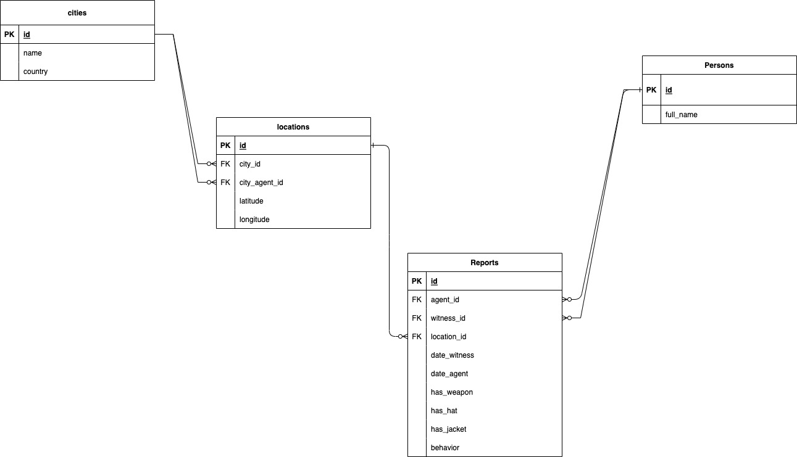

## Carmen Sandiego

### Prerequisites
* Python 3
* Postgres database

### Installation
[here](https://docs.getdbt.com/dbt-cli/install/pip) is a link for detailed instruction on installing dbt with pip.
After installing and setting up dbt, run the command below to confirm dbt is successfully installed
```shell
dbt debug
```

NB: Run the command below to insert the seeds data in the seed directory
```shell
python parse_data_to_seed_directory.py {ABS_PATH_TO_EXCEL_DIRECTORY} {ABS_PATH_TO_SEED_DIRECTORY}
```


### Models
The models documentation can be found [here](https://62c4a7feddfe5b2d7d84f3ce--scintillating-mermaid-1c0eb1.netlify.app/#!/overview/carmen_sandiego)
The dbt models are currently grouped into four different group:
* base: This models contains views referencing data from the seeds directory
* common: These models are mainly ephemeral.
* intermediate: These models are used to normalize the combined region data from base.
* dimensional: These models are used for dimensional data. Currently, the model only contains a date dimension
* analytics: These models are built as views and are used to answer analytical questions

#### ERD Diagram for normalized reports


#### Schema name generation in database
The `get_custom_schema` is responsible for generating schema name based on the following target:
* when running in a production environments: The schema name will remain as defined in the `dbt_project.yml`
* when running in a development environments: The schema name will be concatenated with the default schema defined in the `.dbt/profiles.yml` file.

### Analytics
From the analytics models, the following views are generated:
* **_monthly_region_possible_occurrence_**: This [view](https://62c4a7feddfe5b2d7d84f3ce--scintillating-mermaid-1c0eb1.netlify.app/#!/model/model.carmen_sandiego.monthly_region_possible_occurence) gets the possible region(s) for every month dating back to the minimum date in record. This is done using probability.
it's possible to see multiple records for a specific month within a year. This occurs two regions have the same probability (the highest probability). In the view model, I made use of a
`Rank` function to select the records. The `ROW_NUMBER` function will be better suited if I only need to select just 1 record for each month.
* _**probability_armed_jacket_no_hat**_: This [view](https://62c4a7feddfe5b2d7d84f3ce--scintillating-mermaid-1c0eb1.netlify.app/#!/model/model.carmen_sandiego.probability_armed_jacket_no_hat) gets the probability that Ms. Sandiego is armed and wearing a Jacket but not a hat. The probability is calculated based on the fact that each of the events can be independent of one another.
A general observation from this view is that Ms. Sandiego is most likely to have a Jacket on when sighted
* _**most_occurring_behavior**_: This [view](https://62c4a7feddfe5b2d7d84f3ce--scintillating-mermaid-1c0eb1.netlify.app/#!/model/model.carmen_sandiego.most_occurring_behavior) generates the top 3 most occurring behavior. For this view, I did a simple `group by` using the `behavior` column and order by the count aggregation in descending order.
* **_monthly_probability_most_occurring_behaviour_**: This [view](https://62c4a7feddfe5b2d7d84f3ce--scintillating-mermaid-1c0eb1.netlify.app/#!/model/model.carmen_sandiego.monthly_probability_most_occurring_behavior#details) generates the probability for any of the most occurring behavior for each month. For this view, I wasn't quite sure of the approach to calculate the probability. I was contemplating between using the 
probability of 3 dependent events or just using the count of occurrence divided by total possible occurrence.


